# AI-Powered Design-to-Test: Implementation Phases

This diagram outlines the five key phases for successfully adopting an AI-powered design-to-test workflow — from establishing shared design conventions all the way to continuous improvement.

```mermaid
%%{init: {
  "theme": "base",
  "themeVariables": {
    "primaryColor": "#1e1b4b",
    "primaryTextColor": "#ffffff",
    "primaryBorderColor": "#818cf8",
    "lineColor": "#f0abfc",
    "edgeLabelBackground": "#1e1b4b",
    "fontSize": "15px",
    "fontFamily": "Georgia, 'Times New Roman', serif"
  }
}}%%
flowchart LR
    classDef phase1 fill:#1e1b4b,stroke:#a5b4fc,stroke-width:2px,color:#ffffff,font-weight:bold
    classDef phase2 fill:#0c4a6e,stroke:#38bdf8,stroke-width:2px,color:#ffffff,font-weight:bold
    classDef phase3 fill:#3b0764,stroke:#d8b4fe,stroke-width:2px,color:#ffffff,font-weight:bold
    classDef phase4 fill:#064e3b,stroke:#6ee7b7,stroke-width:2px,color:#ffffff,font-weight:bold
    classDef phase5 fill:#78350f,stroke:#fcd34d,stroke-width:2px,color:#ffffff,font-weight:bold

    P1["🏷️ **Define** consistent\n_design naming &_\n_annotations_"]:::phase1
    P2["⚙️ **Automate** design\n_→ test extraction_"]:::phase2
    P3["🤖 **Configure & refine**\n_AI agents_"]:::phase3
    P4["🔀 **Implement** parallel\n_coding & testing_"]:::phase4
    P5["🔄 **Continuously**\n_review & improve_"]:::phase5

    P1 -->|"📐 _shared vocabulary_"| P2
    P2 -->|"🧠 _structured scenarios_"| P3
    P3 -->|"✅ _validated outputs_"| P4
    P4 -->|"📊 _metrics & feedback_"| P5
    P5 -->|"🔁 _refined conventions_"| P1
```

## Phase Breakdown

| Phase | Description |
|---|---|
| **🏷️ Define naming & annotations** | Establish consistent design token names, component IDs, and annotation conventions so AI agents can reliably parse design files |
| **⚙️ Automate extraction** | Build or configure the pipeline that reads design files (e.g. Figma JSON) and converts them into structured test scenarios automatically |
| **🤖 Configure & refine AI agents** | Tune the Copilot agents responsible for scenario generation, prompt quality, and output validation until results are accurate |
| **🔀 Implement parallel coding & testing** | Run QA test implementation and feature development in parallel, both gated by the same CI pipeline |
| **🔄 Continuously review & improve** | Use metrics, failure data, and team feedback to iteratively refine conventions, extraction rules, and agent prompts |
