# AI-Powered Design-to-Test Workflow

This diagram illustrates how Copilot agents bridge the gap between UI design and automated testing — extracting components from a Figma design, generating test scenarios via a custom AI agent, and driving parallel QA and development streams through to CI/CD merge.

```mermaid
%%{init: {
  "theme": "base",
  "themeVariables": {
    "primaryColor": "#1e1b4b",
    "primaryTextColor": "#ffffff",
    "primaryBorderColor": "#818cf8",
    "lineColor": "#f0abfc",
    "edgeLabelBackground": "#1e1b4b",
    "fontSize": "15px",
    "fontFamily": "Georgia, 'Times New Roman', serif"
  }
}}%%
flowchart LR
    classDef design  fill:#1e1b4b,stroke:#a5b4fc,stroke-width:2px,color:#ffffff,font-weight:bold
    classDef ai      fill:#0c4a6e,stroke:#38bdf8,stroke-width:2px,color:#ffffff,font-weight:bold
    classDef pm      fill:#78350f,stroke:#fcd34d,stroke-width:2px,color:#ffffff,font-weight:bold
    classDef qa      fill:#064e3b,stroke:#6ee7b7,stroke-width:2px,color:#ffffff,font-weight:bold
    classDef dev     fill:#3b0764,stroke:#d8b4fe,stroke-width:2px,color:#ffffff,font-weight:bold
    classDef ci      fill:#7f1d1d,stroke:#fca5a5,stroke-width:2px,color:#ffffff,font-weight:bold
    classDef artifact fill:#0f172a,stroke:#94a3b8,stroke-width:1px,color:#e2e8f0,font-style:italic

    subgraph Design["🎨  D E S I G N"]
        direction TB
        A(["✅ Design\n_Finalised_"]):::design
    end

    subgraph AI_Extraction["🤖  A I   E X T R A C T I O N"]
        direction TB
        E["📥 **Fetch** Design JSON\nvia API or Plugin"]:::ai
        F{{"🧠 **Custom**\n_AI Agent_"}}:::ai
        G(["📋 _Test_\n_Scenarios_"]):::artifact
    end

    subgraph Project_Management["📌  P R O J E C T   M G M T"]
        direction TB
        PM(["🎫 **Issues** /\n_Jira Tickets_"]):::pm
    end

    subgraph QA_Workstream["🧪  Q A   W O R K S T R E A M"]
        direction TB
        QA["🧑‍💻 **QA Implements**\n_UI Tests_"]:::qa
        RP["🔀 **Pull Request**\n« _Test Code_ »"]:::qa
    end

    subgraph Dev_Workstream["⚙️  D E V   W O R K S T R E A M"]
        direction TB
        Dev["👨‍💻 **Implement**\n_Feature Code_"]:::dev
        RD["🔀 **Pull Request**\n« _Feature Code_ »"]:::dev
    end

    subgraph CI_CD["🚀  C I  /  C D"]
        direction TB
        Pipeline["⚡ **CI Runs Tests**\n_via Actions_"]:::ci
        Merge["🎉 **Merge &**\n_Release_"]:::ci
    end

    A        -->|"📦 _components & metadata_"| E
    E        --> F
    F        -->|"✨ _generate scenarios_"| G

    G        --> PM
    G        --> QA
    QA       --> RP
    RP       --> Pipeline

    Dev      --> RD
    RD       --> Pipeline

    Pipeline -->|"❌ _FAIL → fix tests_"| QA
    Pipeline -->|"❌ _FAIL → fix code_"| Dev
    Pipeline -->|"✅ _ALL PASS_"| Merge
```

## How it works

| Stage | Description |
|---|---|
| **🎨 Design** | A finalized UI design (e.g. Figma) is the single source of truth |
| **🤖 AI Extraction** | A Copilot agent fetches the design JSON and generates structured test scenarios |
| **📌 Project Mgmt** | Scenarios are automatically turned into issues / Jira tickets |
| **🧪 QA Workstream** | QA engineers implement UI tests driven by those scenarios |
| **⚙️ Dev Workstream** | Developers implement the matching feature code in parallel |
| **🚀 CI / CD** | Both PRs are gated by the same CI pipeline; failures route back to the responsible workstream |
